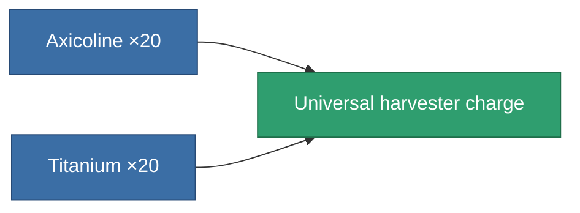

<!-- Generated by tools/generate from the live database (source: entitydefaults definition 891, aggregatevalues via aggregatefields).
     Do not edit by hand; regenerate instead. -->

# Universal harvester charge

|  |  |
|---|---|
| Definition | `def_ammo_harvesting_standard` |
| Tier | – |
| Health | 100 |
| Volume | 0.5 |
| Mass | 0.1 |
| Category | Ammo / Harvesting |

_No stats — this item carries no aggregate values._

<!-- production:generated -->
## Production

**Produced from 2 components, research level 1** — assemble the components to build it (see [Recipes](/content/recipes/) for the full list):

[All items](/content/items/)
