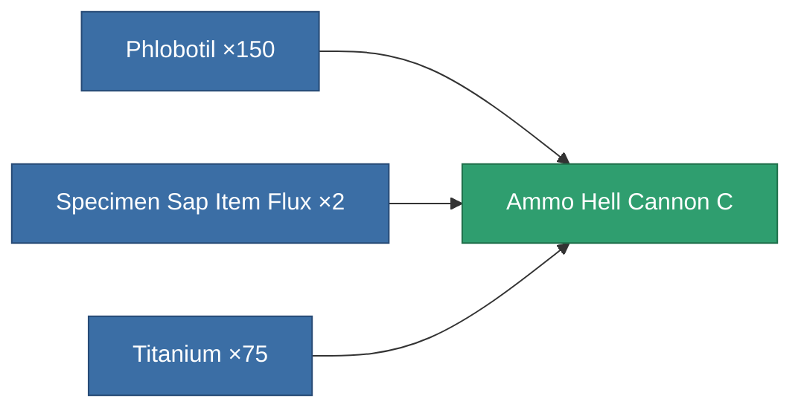

<!-- Generated by tools/generate from the live database (source: entitydefaults definition 269, aggregatevalues via aggregatefields).
     Do not edit by hand; regenerate instead. -->

# Ammo Hell Cannon C

|  |  |
|---|---|
| Definition | `def_ammo_hell_cannon_c` |
| Tier | – |
| Health | 100 |
| Volume | 2 |
| Mass | 0.4 |
| Category | Ammo / Cannon |

## Stats

| Field | Value |
|---|---|
| damage_explosive | 72 |
| damage_kinetic | 36 |
| damage_toxic | 18 |

<!-- production:generated -->
## Production

**Produced from 3 components** — assemble the components to build it (see [Recipes](/content/recipes/) for the full list):

[All items](/content/items/)
