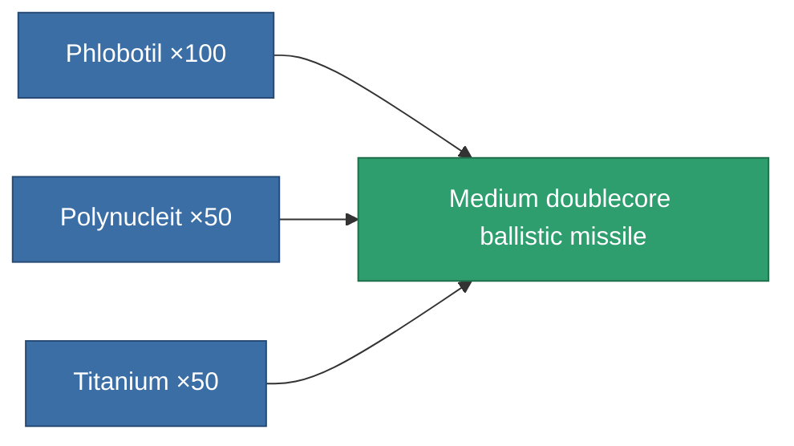

<!-- Generated by tools/generate from the live database (source: entitydefaults definition 1038, aggregatevalues via aggregatefields).
     Do not edit by hand; regenerate instead. -->

# Medium doublecore ballistic missile

|  |  |
|---|---|
| Definition | `def_ammo_longrange_missile_c` |
| Tier | – |
| Health | 100 |
| Volume | 1 |
| Mass | 0.4 |
| Category | Ammo / Missiles |
| Note | 500 * 0.002 => 1 Volume!!!! |

## Stats

| Field | Value |
|---|---|
| damage_explosive | 40 |
| damage_thermal | 30 |
| explosion_radius | 13 |
| optimal_range | 30 |

<!-- production:generated -->
## Production

**Produced from 3 components, research level 3** — assemble the components to build it (see [Recipes](/content/recipes/) for the full list):

[All items](/content/items/)
