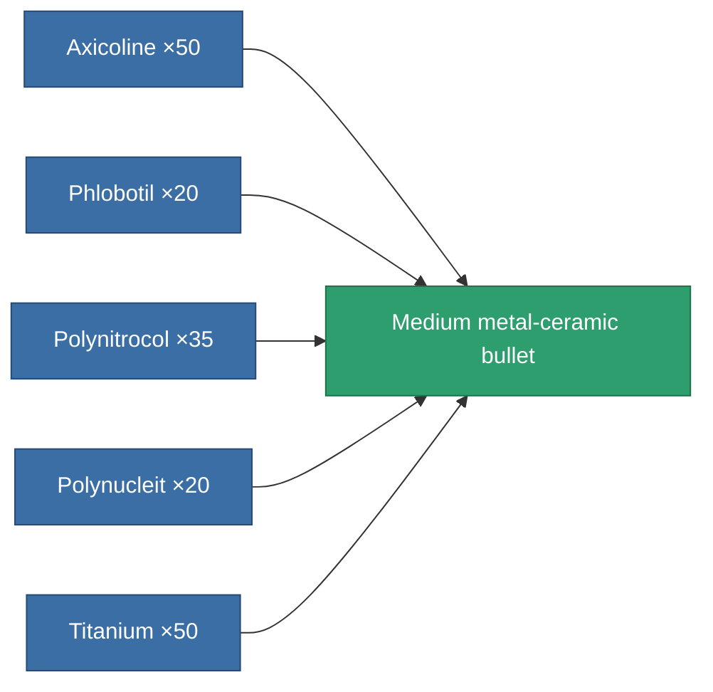

<!-- Generated by tools/generate from the live database (source: entitydefaults definition 264, aggregatevalues via aggregatefields).
     Do not edit by hand; regenerate instead. -->

# Medium metal-ceramic bullet

|  |  |
|---|---|
| Definition | `def_ammo_medium_projectile_b` |
| Tier | – |
| Health | 100 |
| Volume | 1 |
| Mass | 0.2 |
| Category | Ammo / Projectiles |

## Stats

| Field | Value |
|---|---|
| damage_explosive | 8 |
| damage_kinetic | 8 |
| damage_thermal | 20 |
| damage_toxic | 6 |
| optimal_range_modifier | 1 |

<!-- production:generated -->
## Production

**Produced from 5 components, research level 2** — assemble the components to build it (see [Recipes](/content/recipes/) for the full list):

[All items](/content/items/)
