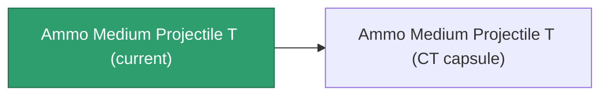

<!-- Generated by tools/generate from the live database (source: entitydefaults definition 5927, aggregatevalues via aggregatefields).
     Do not edit by hand; regenerate instead. -->

# Ammo Medium Projectile T

|  |  |
|---|---|
| Definition | `def_ammo_medium_projectile_t` |
| Tier | – |
| Health | 100 |
| Volume | 1 |
| Mass | 0.2 |
| Category | Ammo / Projectiles |
| Note | toxic ammo med |

## Stats

| Field | Value |
|---|---|
| damage_chemical | 12 |
| damage_explosive | 2 |
| damage_kinetic | 2 |
| damage_thermal | 2 |
| damage_toxic | 40 |

## Transport capsule

A transport capsule (CT) exists for this item — it is how the item moves between players and zones.

[All items](/content/items/)
