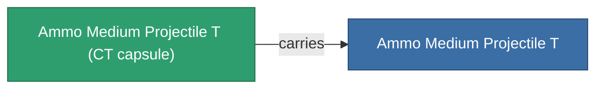

<!-- Generated by tools/generate from the live database (source: entitydefaults definition 5927, aggregatevalues via aggregatefields).
     Do not edit by hand; regenerate instead. -->

# Ammo Medium Projectile T

|  |  |
|---|---|
| Definition | `def_ammo_medium_projectile_t` |
| Tier | – |
| Health | 100 |
| Volume | 1 |
| Mass | 0.2 |
| Category | Ammo / Projectiles |
| Note | toxic ammo med |

## Stats

| Field | Value |
|---|---|
| damage_chemical | 12 |
| damage_explosive | 2 |
| damage_kinetic | 2 |
| damage_thermal | 2 |
| damage_toxic | 40 |

## Transport capsule

A transport capsule (CT) exists for this item — it is how the item moves between players and zones.

<!-- production:generated -->
## Production

**Produced from 5 components** — assemble the components to build it (see [Recipes](/content/recipes/) for the full list):

<svg class="prod-card-icon" aria-hidden="true"><use href="#mi-grid"/></svg><a class="prod-card-name" href="/content/items/axicoline/">Axicoline</a>

required: <b>200</b>

<svg class="prod-card-icon" aria-hidden="true"><use href="#mi-grid"/></svg><a class="prod-card-name" href="/content/items/phlobotil/">Phlobotil</a>

required: <b>200</b>

<svg class="prod-card-icon" aria-hidden="true"><use href="#mi-grid"/></svg><a class="prod-card-name" href="/content/items/polynitrocol/">Polynitrocol</a>

required: <b>200</b>

<svg class="prod-card-icon" aria-hidden="true"><use href="#mi-grid"/></svg><a class="prod-card-name" href="/content/items/polynucleit/">Polynucleit</a>

required: <b>200</b>

<svg class="prod-card-icon" aria-hidden="true"><use href="#mi-grid"/></svg><a class="prod-card-name" href="/content/items/titanium/">Titanium</a>

required: <b>200</b>

