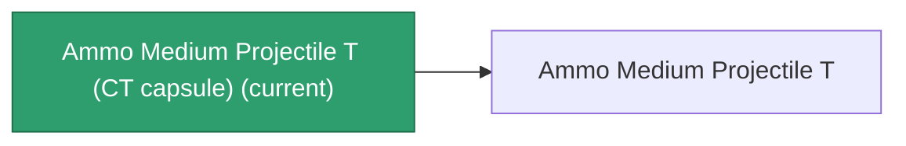

<!-- Generated by tools/generate from the live database (source: entitydefaults definition 5929, aggregatevalues via aggregatefields).
     Do not edit by hand; regenerate instead. -->

# Ammo Medium Projectile T (CT capsule)

|  |  |
|---|---|
| Definition | `def_ammo_medium_projectile_t_CT_capsule` |
| Tier | – |
| Health | 100 |
| Volume | 0.1 |
| Mass | 0.1 |
| Category | Ammo / Projectiles |
| Note | CT Capsule! |

_No stats — this item carries no aggregate values._

## Production

The item this capsule carries, and how it is produced (see [Recipes](/content/recipes/) for the full list).

|  |  |
|---|---|
| Research level | – |
| Production cost | Titanium ×200, Phlobotil ×200, Polynucleit ×200, Polynitrocol ×200, Axicoline ×200 |
| Output | [Ammo Medium Projectile T](/content/items/ammo-medium-projectile-t/) |

## Where to buy

Fixed-price vendors that sell this item (see the [Item shop](/content/shop/) for the full catalog).

| Vendor | Qty | Credits | UniCoin |
|---|---|---|---|
| New Virginia (zone_TM) | 1 | 5000000 | 100 |
| Attalica (zone_ICS) | 1 | 5000000 | 100 |
| Attalica outpost | 1 | 5000000 | 100 |
| Daoden (zone_ASI) | 1 | 5000000 | 100 |
| Daoden outpost | 1 | 5000000 | 100 |

[All items](/content/items/)
