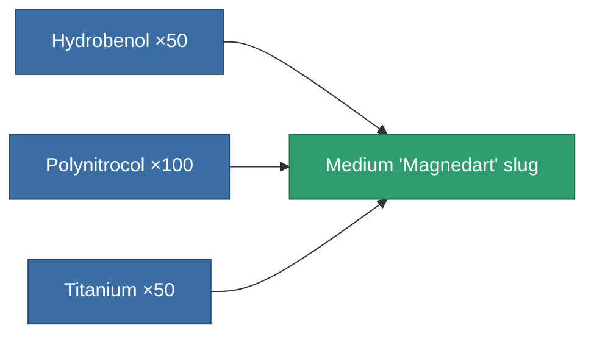

<!-- Generated by tools/generate from the live database (source: entitydefaults definition 2435, aggregatevalues via aggregatefields).
     Do not edit by hand; regenerate instead. -->

# Medium 'Magnedart' slug

|  |  |
|---|---|
| Definition | `def_ammo_medium_railgun_rewb` |
| Tier | – |
| Health | 100 |
| Volume | 1 |
| Mass | 0.2 |
| Category | Ammo / Cannon |

## Stats

| Field | Value |
|---|---|
| damage_kinetic | 60 |
| optimal_range_modifier | 0.8 |

## Where to buy

Fixed-price vendors that sell this item (see the [Item shop](/content/shop/) for the full catalog).

| Vendor | Qty | ICS Coin | Credits |
|---|---|---|---|
| New Virginia (zone_TM) | ∞ | 600 | 1.2M |
| Attalica (zone_ICS) | ∞ | 600 | 1.2M |
| Attalica outpost | ∞ | 600 | 1.2M |
| Daoden (zone_ASI) | ∞ | 600 | 1.2M |
| Daoden outpost | ∞ | 600 | 1.2M |

<!-- production:generated -->
## Production

**Produced from 3 components** — assemble the components to build it (see [Recipes](/content/recipes/) for the full list):

[All items](/content/items/)
