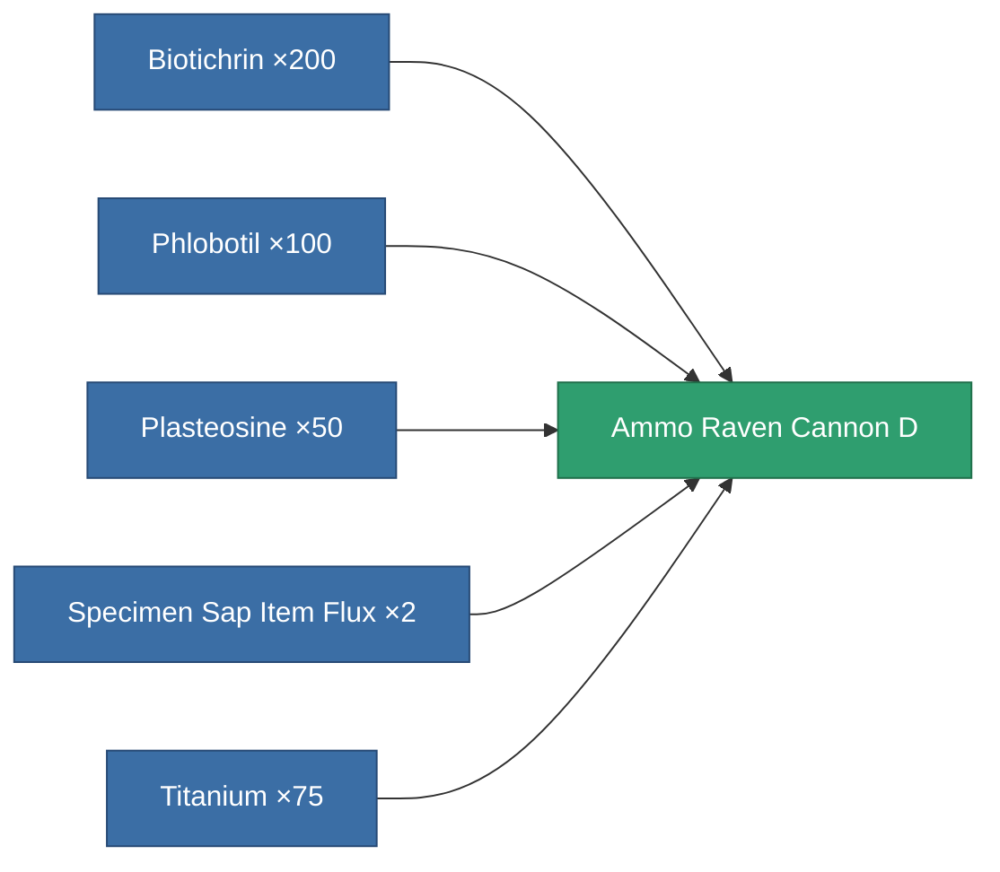

<!-- Generated by tools/generate from the live database (source: entitydefaults definition 8896, aggregatevalues via aggregatefields).
     Do not edit by hand; regenerate instead. -->

# Ammo Raven Cannon D

|  |  |
|---|---|
| Definition | `def_ammo_raven_cannon_d` |
| Tier | – |
| Health | 100 |
| Volume | 2 |
| Mass | 0.4 |
| Category | Ammo / Cannon |

## Stats

| Field | Value |
|---|---|
| damage_chemical | 48 |
| damage_explosive | 48 |
| damage_kinetic | 48 |
| damage_toxic | 24 |

<!-- production:generated -->
## Production

**Produced from 5 components** — assemble the components to build it (see [Recipes](/content/recipes/) for the full list):

[All items](/content/items/)
