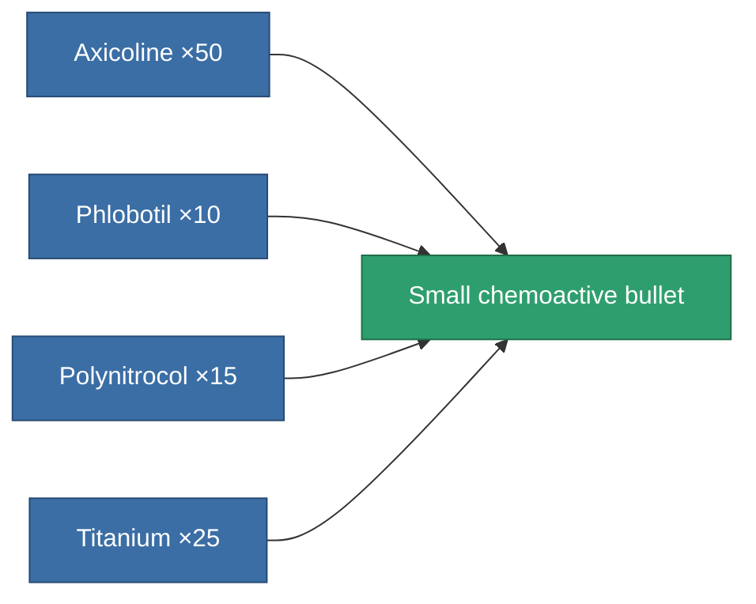

<!-- Generated by tools/generate from the live database (source: entitydefaults definition 262, aggregatevalues via aggregatefields).
     Do not edit by hand; regenerate instead. -->

# Small chemoactive bullet

|  |  |
|---|---|
| Definition | `def_ammo_small_projectile_d` |
| Tier | – |
| Health | 100 |
| Volume | 0.5 |
| Mass | 0.1 |
| Category | Ammo / Projectiles |

## Stats

| Field | Value |
|---|---|
| damage_chemical | 6 |
| damage_explosive | 6 |
| damage_kinetic | 6 |
| damage_toxic | 3 |

<!-- production:generated -->
## Production

**Produced from 4 components, research level 1** — assemble the components to build it (see [Recipes](/content/recipes/) for the full list):

[All items](/content/items/)
