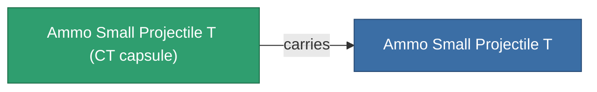
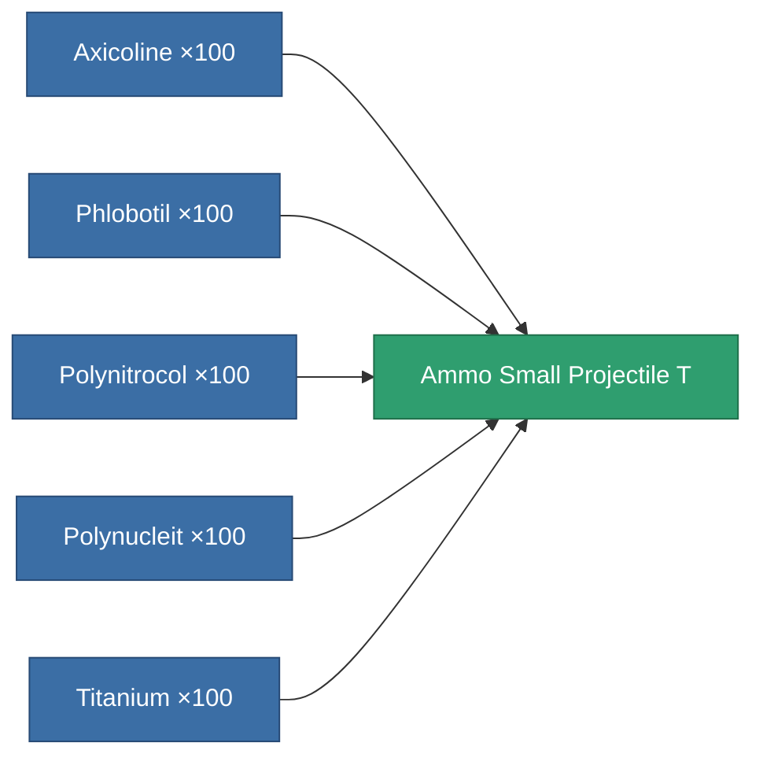

<!-- Generated by tools/generate from the live database (source: entitydefaults definition 5924, aggregatevalues via aggregatefields).
     Do not edit by hand; regenerate instead. -->

# Ammo Small Projectile T

|  |  |
|---|---|
| Definition | `def_ammo_small_projectile_t` |
| Tier | – |
| Health | 100 |
| Volume | 0.5 |
| Mass | 0.1 |
| Category | Ammo / Projectiles |
| Note | toxic ammo small |

## Stats

| Field | Value |
|---|---|
| damage_chemical | 6 |
| damage_explosive | 1 |
| damage_kinetic | 1 |
| damage_thermal | 1 |
| damage_toxic | 20 |

## Transport capsule

A transport capsule (CT) exists for this item — it is how the item moves between players and zones.

<!-- production:generated -->
## Production

**Produced from 5 components** — assemble the components to build it (see [Recipes](/content/recipes/) for the full list):

[All items](/content/items/)
