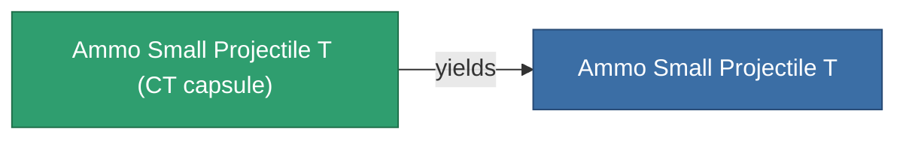

<!-- Generated by tools/generate from the live database (source: entitydefaults definition 5926, aggregatevalues via aggregatefields).
     Do not edit by hand; regenerate instead. -->

# Ammo Small Projectile T (CT capsule)

|  |  |
|---|---|
| Definition | `def_ammo_small_projectile_t_CT_capsule` |
| Tier | – |
| Health | 100 |
| Volume | 0.1 |
| Mass | 0.1 |
| Category | Ammo / Projectiles |
| Note | CT Capsule! |

_No stats — this item carries no aggregate values._

## Production

The item this capsule carries, and how it is produced (see [Recipes](/content/recipes/) for the full list).

|  |  |
|---|---|
| Research level | – |
| Production cost | Axicoline ×100, Phlobotil ×100, Polynitrocol ×100, Polynucleit ×100, Titanium ×100 |
| Output | [Ammo Small Projectile T](/content/items/ammo-small-projectile-t/) |

## Where to buy

Fixed-price vendors that sell this item (see the [Item shop](/content/shop/) for the full catalog).

| Vendor | Qty | Credits | UniCoin |
|---|---|---|---|
| New Virginia (zone_TM) | ∞ | 1M | 20 |
| Attalica (zone_ICS) | ∞ | 1M | 20 |
| Attalica outpost | ∞ | 1M | 20 |
| Daoden (zone_ASI) | ∞ | 1M | 20 |
| Daoden outpost | ∞ | 1M | 20 |

[All items](/content/items/)
