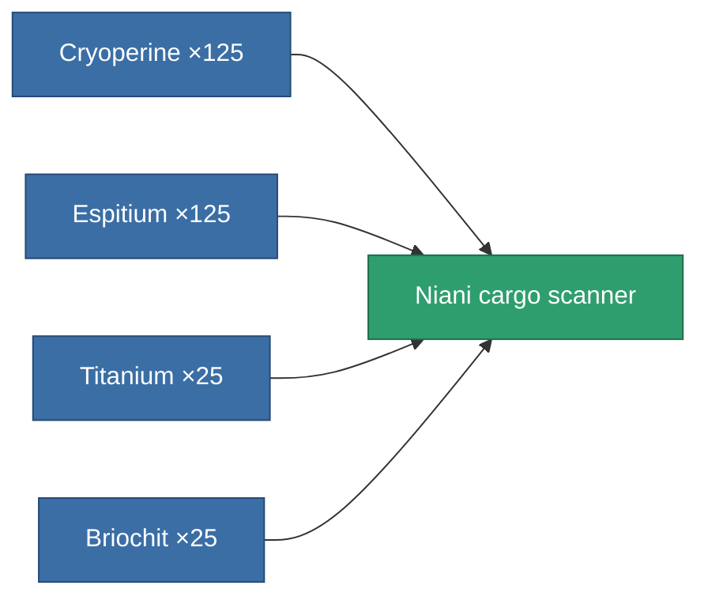

<!-- Generated by tools/generate from the live database (source: entitydefaults definition 3194, aggregatevalues via aggregatefields).
     Do not edit by hand; regenerate instead. -->

# Niani cargo scanner

|  |  |
|---|---|
| Definition | `def_artifact_a_cargo_scanner` |
| Tier | T3 (special) |
| Health | 100 |
| Volume | 0.25 |
| Mass | 90 |
| Category | Artifacts |

## Stats

| Field | Value |
|---|---|
| core_usage | 65 |
| cpu_usage | 28 |
| cycle_time | 7.5k |
| falloff | 20 |
| optimal_range | 15 |
| powergrid_usage | 12 |

<!-- production:generated -->
## Production

**Produced from 4 components** — assemble the components to build it (see [Recipes](/content/recipes/) for the full list):

[All items](/content/items/)
