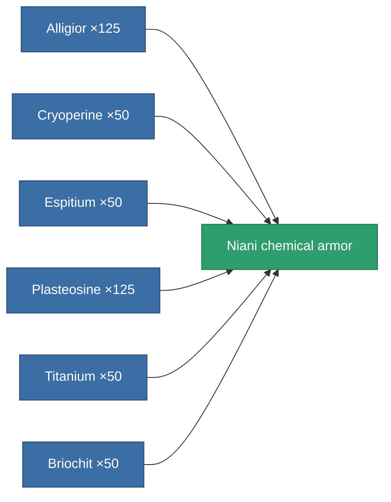

<!-- Generated by tools/generate from the live database (source: entitydefaults definition 3146, aggregatevalues via aggregatefields).
     Do not edit by hand; regenerate instead. -->

# Niani chemical armor

|  |  |
|---|---|
| Definition | `def_artifact_a_chm_armor_hardener` |
| Tier | 3 |
| Health | 100 |
| Volume | 0.5 |
| Mass | 90 |
| Category | Artifacts |

## Stats

| Field | Value |
|---|---|
| core_usage | 13 |
| cpu_usage | 28 |
| cycle_time | 10k |
| effect_resist_chemical | 110 |
| powergrid_usage | 6 |
| resist_chemical | 25 |

<!-- production:generated -->
## Production

**Produced from 6 components** — assemble the components to build it (see [Recipes](/content/recipes/) for the full list):

[All items](/content/items/)
