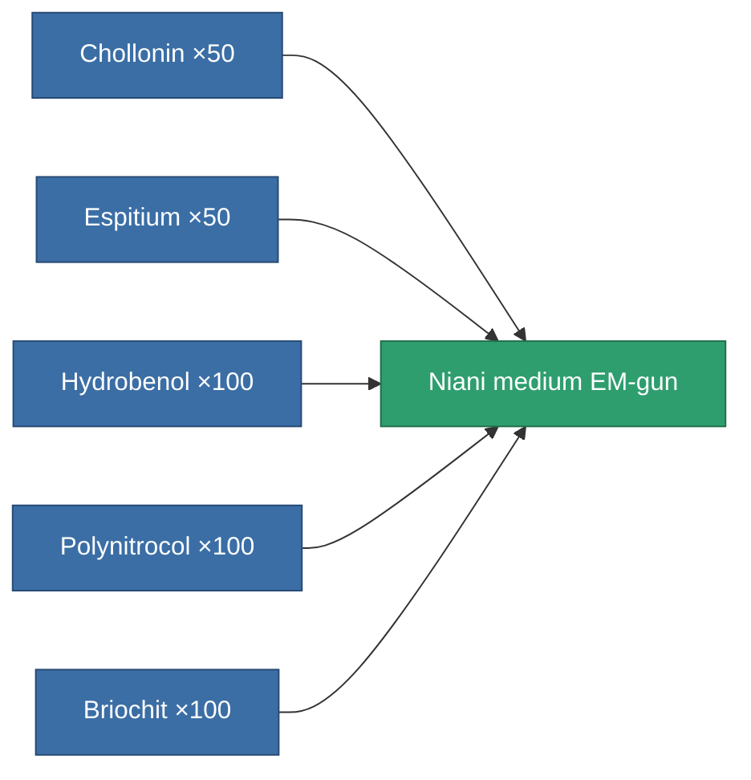

<!-- Generated by tools/generate from the live database (source: entitydefaults definition 3245, aggregatevalues via aggregatefields).
     Do not edit by hand; regenerate instead. -->

# Niani medium EM-gun

|  |  |
|---|---|
| Definition | `def_artifact_a_longrange_medium_railgun` |
| Tier | 3 |
| Health | 100 |
| Volume | 0.5 |
| Mass | 650 |
| Category | Artifacts |

## Stats

| Field | Value |
|---|---|
| accuracy | 14 |
| core_usage | 25 |
| cpu_usage | 45 |
| cycle_time | 10k |
| damage_modifier | 2.5 |
| falloff | 6 |
| least_optimal | 22 |
| optimal_range | 30 |
| powergrid_usage | 205 |

<!-- production:generated -->
## Production

**Produced from 5 components** — assemble the components to build it (see [Recipes](/content/recipes/) for the full list):

[All items](/content/items/)
