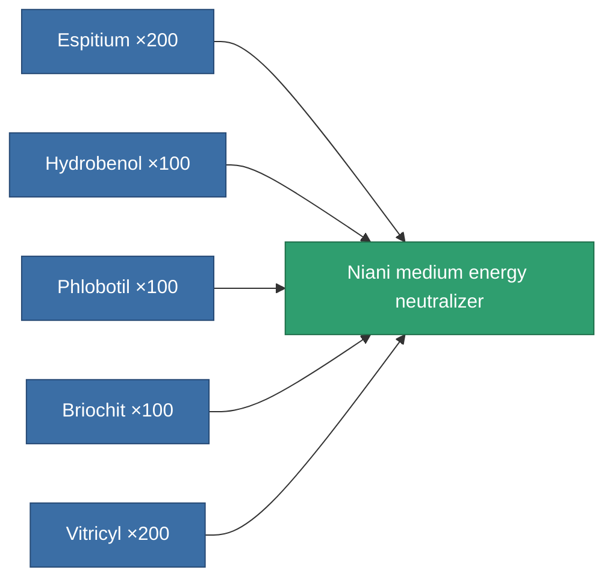

<!-- Generated by tools/generate from the live database (source: entitydefaults definition 3174, aggregatevalues via aggregatefields).
     Do not edit by hand; regenerate instead. -->

# Niani medium energy neutralizer

|  |  |
|---|---|
| Definition | `def_artifact_a_medium_energy_neutralizer` |
| Tier | T3 (special) |
| Health | 100 |
| Volume | 0.5 |
| Mass | 450 |
| Category | Artifacts |

## Stats

| Field | Value |
|---|---|
| core_usage | 225 |
| cpu_usage | 40 |
| cycle_time | 10k |
| energy_dispersion | 10 |
| energy_neutralized_amount | 270 |
| falloff | 0 |
| optimal_range | 25 |
| powergrid_usage | 235 |

<!-- production:generated -->
## Production

**Produced from 5 components** — assemble the components to build it (see [Recipes](/content/recipes/) for the full list):

[All items](/content/items/)
