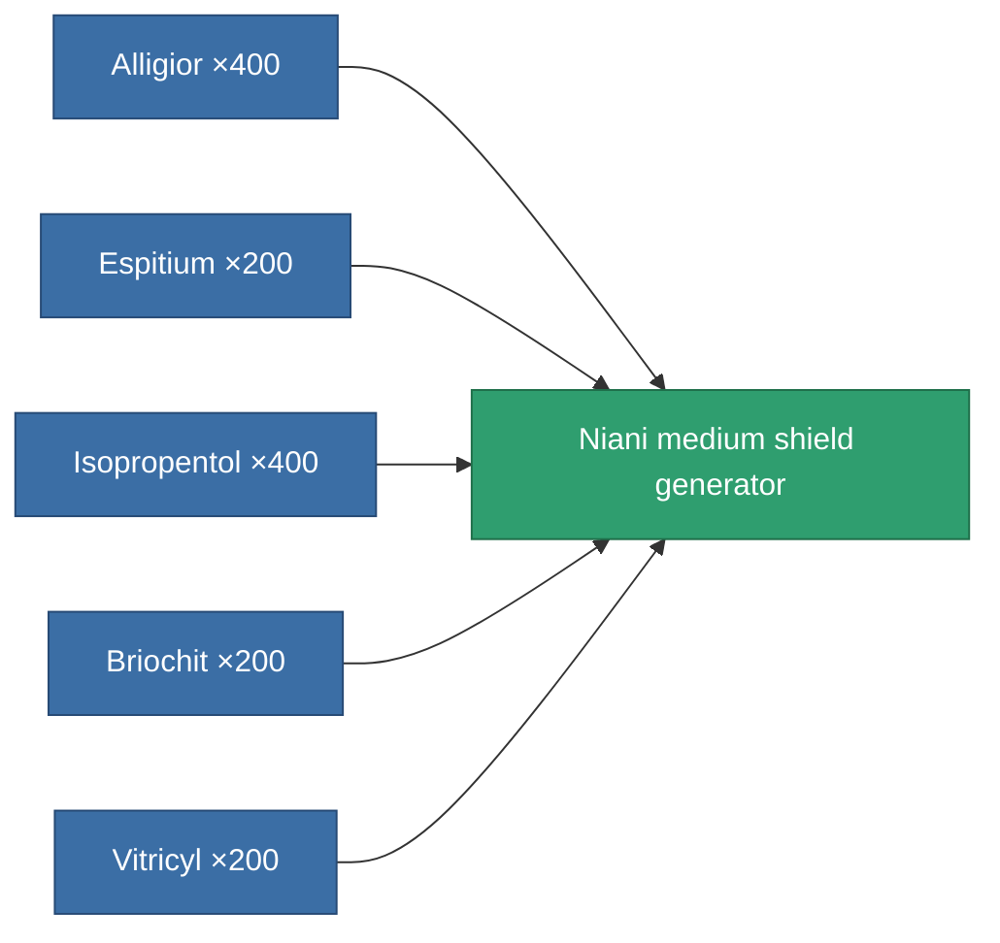

<!-- Generated by tools/generate from the live database (source: entitydefaults definition 3160, aggregatevalues via aggregatefields).
     Do not edit by hand; regenerate instead. -->

# Niani medium shield generator

|  |  |
|---|---|
| Definition | `def_artifact_a_medium_shield_generator` |
| Tier | T3 (special) |
| Health | 100 |
| Volume | 0.25 |
| Mass | 360 |
| Category | Artifacts |

## Stats

| Field | Value |
|---|---|
| core_usage | 12.5 |
| cpu_usage | 74 |
| cycle_time | 8.5k |
| powergrid_usage | 300 |
| shield_absorbtion | 2.2 |
| shield_radius | 12 |

<!-- production:generated -->
## Production

**Produced from 5 components** — assemble the components to build it (see [Recipes](/content/recipes/) for the full list):

[All items](/content/items/)
