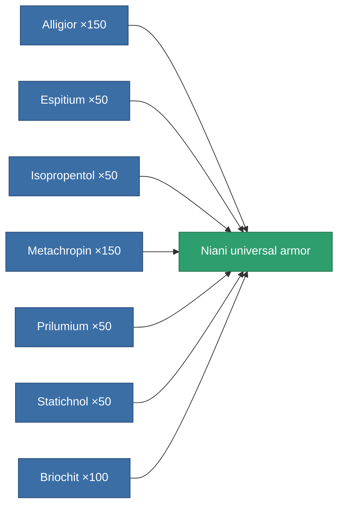

<!-- Generated by tools/generate from the live database (source: entitydefaults definition 3154, aggregatevalues via aggregatefields).
     Do not edit by hand; regenerate instead. -->

# Niani universal armor

|  |  |
|---|---|
| Definition | `def_artifact_a_resistant_plating` |
| Tier | T3 (special) |
| Health | 100 |
| Volume | 0.75 |
| Mass | 225 |
| Category | Artifacts |

## Stats

| Field | Value |
|---|---|
| cpu_usage | 41 |
| powergrid_usage | 12 |
| resist_chemical | 33 |
| resist_explosive | 33 |
| resist_kinetic | 33 |
| resist_thermal | 33 |

<!-- production:generated -->
## Production

**Produced from 7 components** — assemble the components to build it (see [Recipes](/content/recipes/) for the full list):

[All items](/content/items/)
