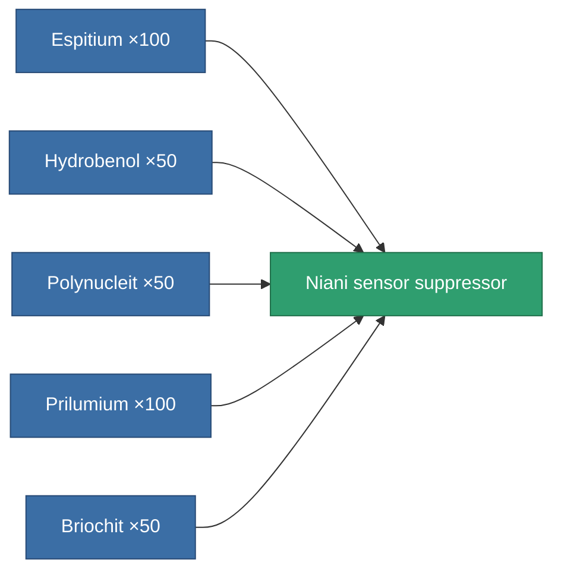

<!-- Generated by tools/generate from the live database (source: entitydefaults definition 3212, aggregatevalues via aggregatefields).
     Do not edit by hand; regenerate instead. -->

# Niani sensor suppressor

|  |  |
|---|---|
| Definition | `def_artifact_a_sensor_dampener` |
| Tier | 3 |
| Health | 100 |
| Volume | 0.25 |
| Mass | 135 |
| Category | Artifacts |

## Stats

| Field | Value |
|---|---|
| core_usage | 18 |
| cpu_usage | 41 |
| cycle_time | 5k |
| ecm_strength | 65 |
| effect_sensor_dampener_locking_range_modifier | 0.8 |
| effect_sensor_dampener_locking_time_modifier | 1.35 |
| falloff | 0 |
| optimal_range | 33 |
| powergrid_usage | 21 |

<!-- production:generated -->
## Production

**Produced from 5 components** — assemble the components to build it (see [Recipes](/content/recipes/) for the full list):

[All items](/content/items/)
