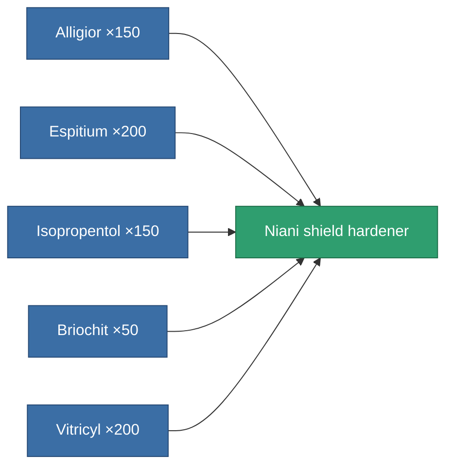

<!-- Generated by tools/generate from the live database (source: entitydefaults definition 3162, aggregatevalues via aggregatefields).
     Do not edit by hand; regenerate instead. -->

# Niani shield hardener

|  |  |
|---|---|
| Definition | `def_artifact_a_shield_hardener` |
| Tier | 3 |
| Health | 100 |
| Volume | 0.25 |
| Mass | 270 |
| Category | Artifacts |
| Note | ettol a modultol tud jobban mudkodni a pajzs = kevesebb lesz a core csokkenes |

## Stats

| Field | Value |
|---|---|
| cpu_usage | 55 |
| powergrid_usage | 23 |
| shield_absorbtion_modifier | 1.25 |

<!-- production:generated -->
## Production

**Produced from 5 components** — assemble the components to build it (see [Recipes](/content/recipes/) for the full list):

[All items](/content/items/)
