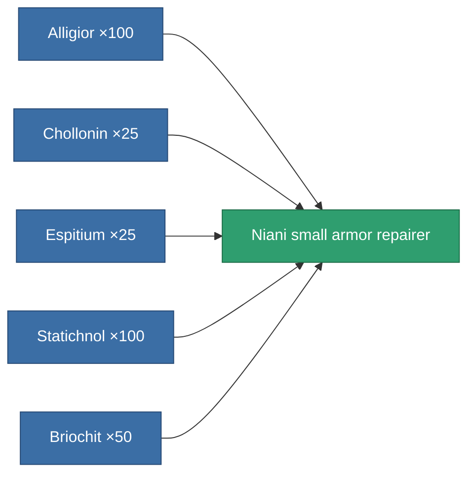

<!-- Generated by tools/generate from the live database (source: entitydefaults definition 3136, aggregatevalues via aggregatefields).
     Do not edit by hand; regenerate instead. -->

# Niani small armor repairer

|  |  |
|---|---|
| Definition | `def_artifact_a_small_armor_repairer` |
| Tier | 3 |
| Health | 100 |
| Volume | 0.5 |
| Mass | 225 |
| Category | Artifacts |
| Note | armor_hp += repair_amount * armor_repair_amount_modifier  rof = cycle_time * armor_repair_cycle_time_modifier   |

## Stats

| Field | Value |
|---|---|
| armor_repair_amount | 70 |
| core_usage | 70 |
| cpu_usage | 38 |
| cycle_time | 13.5k |
| powergrid_usage | 26 |

<!-- production:generated -->
## Production

**Produced from 5 components** — assemble the components to build it (see [Recipes](/content/recipes/) for the full list):

[All items](/content/items/)
