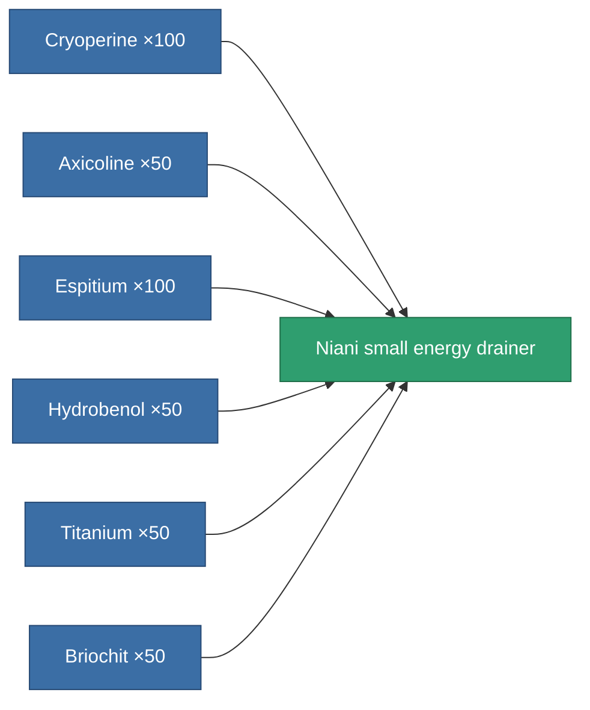

<!-- Generated by tools/generate from the live database (source: entitydefaults definition 3168, aggregatevalues via aggregatefields).
     Do not edit by hand; regenerate instead. -->

# Niani small energy drainer

|  |  |
|---|---|
| Definition | `def_artifact_a_small_energy_vampire` |
| Tier | T3 (special) |
| Health | 100 |
| Volume | 0.25 |
| Mass | 90 |
| Category | Artifacts |
| Note | range = optimal_range *  energy_transferers_optimal_range_modifier    cel core -= energy_vampired_amount  sajat core += energy_vampired_amount    csak akkor mukodik ha a cel coreja nagyobb mint a tied. |

## Stats

| Field | Value |
|---|---|
| core_usage | 5 |
| cpu_usage | 51 |
| cycle_time | 8k |
| energy_dispersion | 4 |
| energy_vampired_amount | 22 |
| falloff | 0 |
| optimal_range | 14 |
| powergrid_usage | 41 |

<!-- production:generated -->
## Production

**Produced from 6 components** — assemble the components to build it (see [Recipes](/content/recipes/) for the full list):

[All items](/content/items/)
