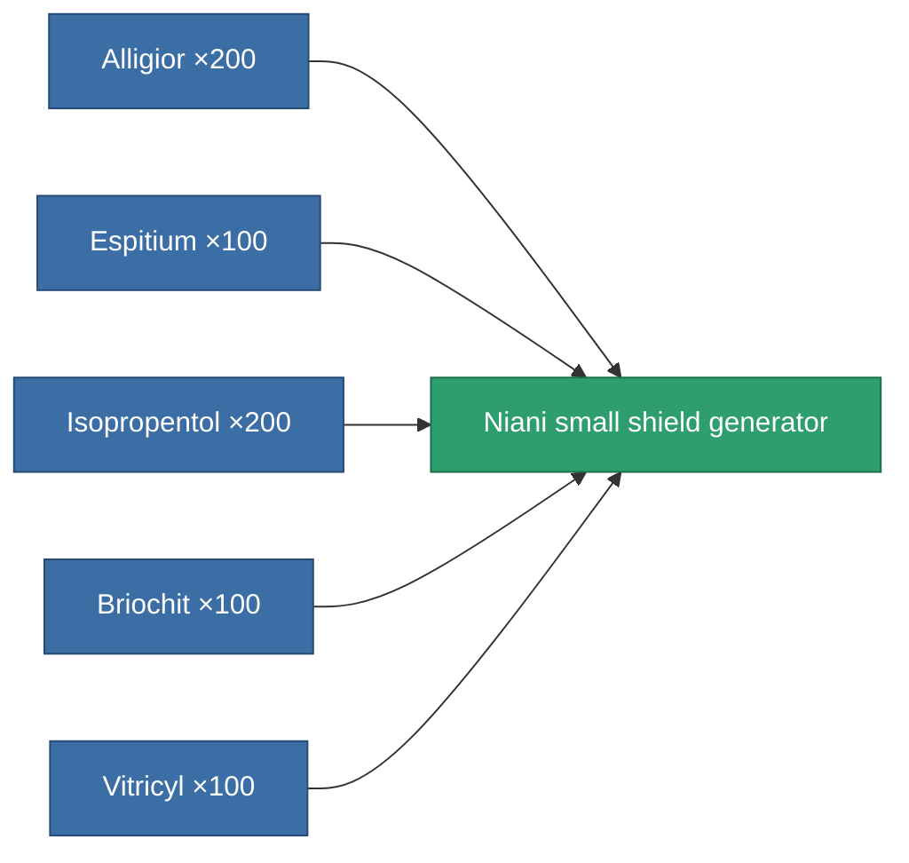

<!-- Generated by tools/generate from the live database (source: entitydefaults definition 3158, aggregatevalues via aggregatefields).
     Do not edit by hand; regenerate instead. -->

# Niani small shield generator

|  |  |
|---|---|
| Definition | `def_artifact_a_small_shield_generator` |
| Tier | T3 (special) |
| Health | 100 |
| Volume | 0.15 |
| Mass | 180 |
| Category | Artifacts |
| Note | damage to core = shield_absorbtion * shield_absorbtion_modifier  amig ez a modul fut addig nincs damage, csak a core-bol von le.  |

## Stats

| Field | Value |
|---|---|
| core_usage | 1 |
| cpu_usage | 52 |
| cycle_time | 2.375k |
| powergrid_usage | 59 |
| shield_absorbtion | 2.2 |
| shield_radius | 4.5 |

<!-- production:generated -->
## Production

**Produced from 5 components** — assemble the components to build it (see [Recipes](/content/recipes/) for the full list):

[All items](/content/items/)
