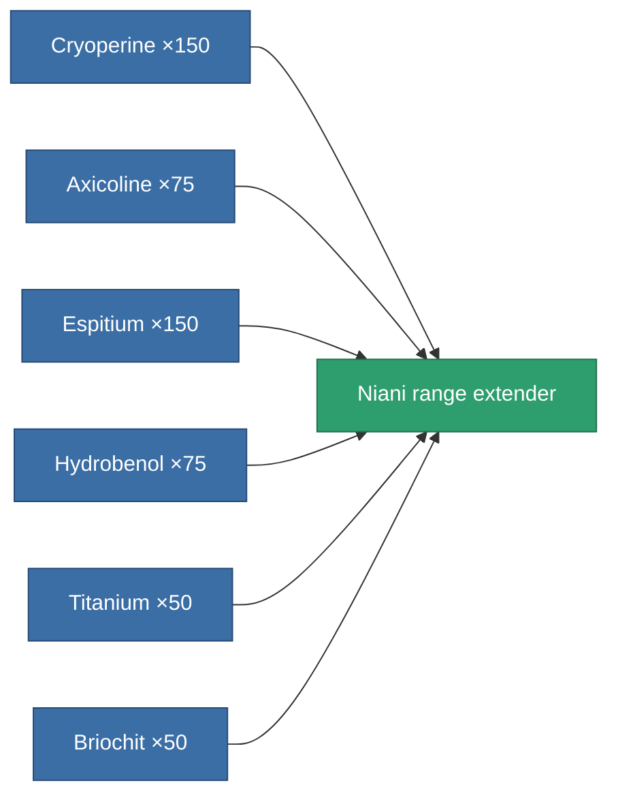

<!-- Generated by tools/generate from the live database (source: entitydefaults definition 3200, aggregatevalues via aggregatefields).
     Do not edit by hand; regenerate instead. -->

# Niani range extender

|  |  |
|---|---|
| Definition | `def_artifact_a_tracking_upgrade` |
| Tier | T3 (special) |
| Health | 100 |
| Volume | 0.05 |
| Mass | 45 |
| Category | Artifacts |

## Stats

| Field | Value |
|---|---|
| cpu_usage | 42 |
| optimal_range_modifier | 1.125 |
| powergrid_usage | 121 |

<!-- production:generated -->
## Production

**Produced from 6 components** — assemble the components to build it (see [Recipes](/content/recipes/) for the full list):

[All items](/content/items/)
