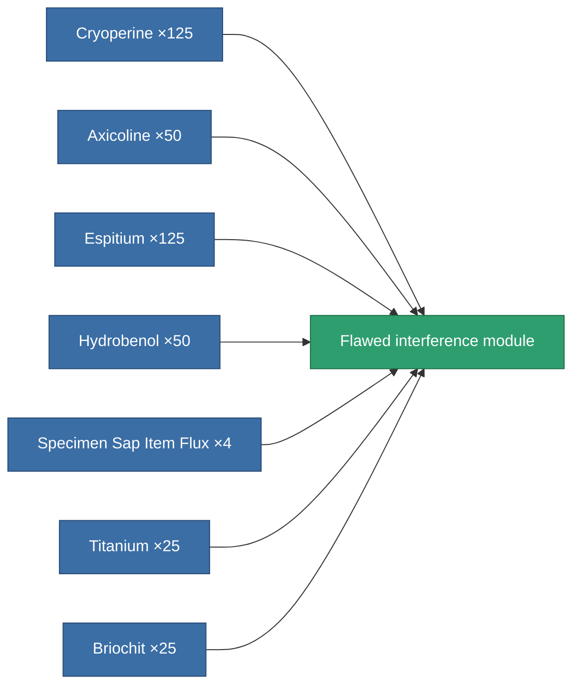

<!-- Generated by tools/generate from the live database (source: entitydefaults definition 3215, aggregatevalues via aggregatefields).
     Do not edit by hand; regenerate instead. -->

# Flawed interference module

|  |  |
|---|---|
| Definition | `def_artifact_damaged_blob_emission_modulator` |
| Tier | – |
| Health | 100 |
| Volume | 0.25 |
| Mass | 150 |
| Category | Artifacts |

## Stats

| Field | Value |
|---|---|
| blob_emission_modifier | 0.6 |
| blob_emission_radius_modifier | 0.6 |
| core_usage | 50 |
| cpu_usage | 85 |
| cycle_time | 5k |
| optimal_range | 25 |
| powergrid_usage | 150 |

<!-- production:generated -->
## Production

**Produced from 7 components** — assemble the components to build it (see [Recipes](/content/recipes/) for the full list):

[All items](/content/items/)
