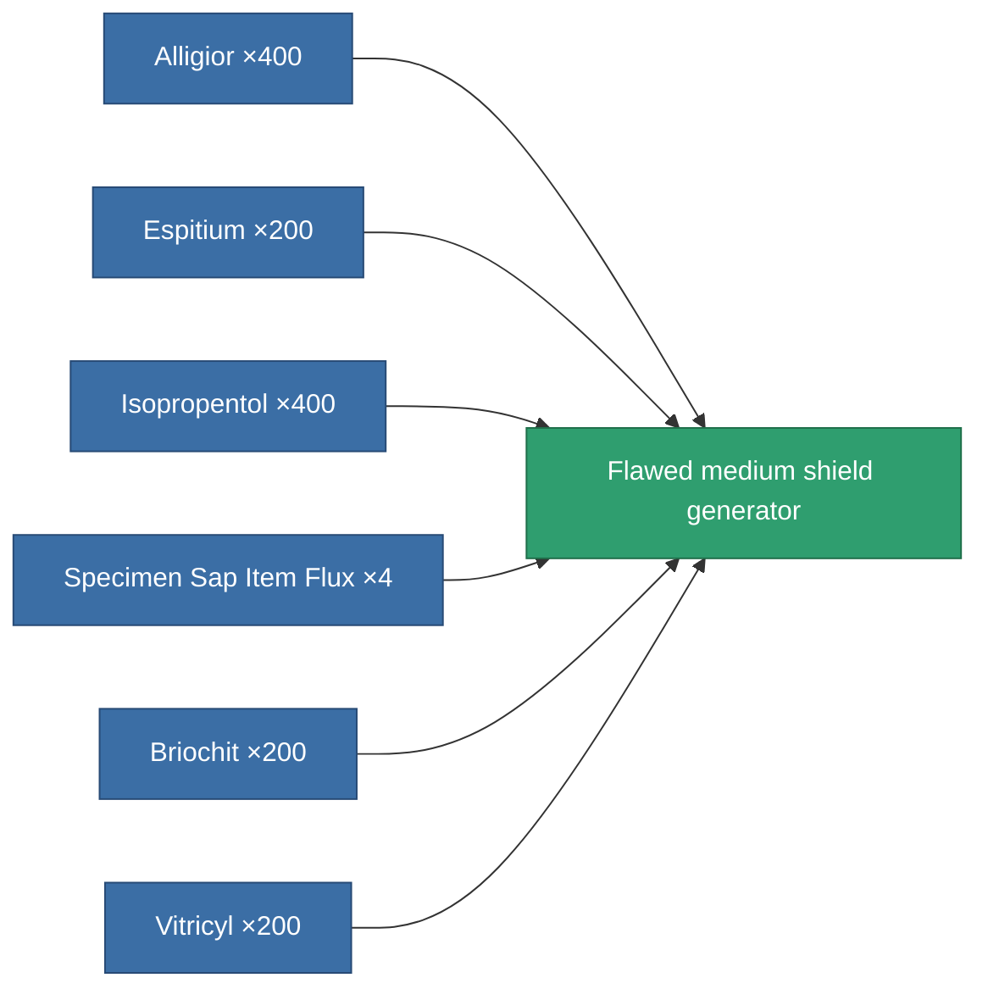

<!-- Generated by tools/generate from the live database (source: entitydefaults definition 3159, aggregatevalues via aggregatefields).
     Do not edit by hand; regenerate instead. -->

# Flawed medium shield generator

|  |  |
|---|---|
| Definition | `def_artifact_damaged_medium_shield_generator` |
| Tier | – |
| Health | 100 |
| Volume | 0.25 |
| Mass | 400 |
| Category | Artifacts |

## Stats

| Field | Value |
|---|---|
| core_usage | 12.5 |
| cpu_usage | 65 |
| cycle_time | 12k |
| powergrid_usage | 250 |
| shield_absorbtion | 1.2 |
| shield_radius | 8 |

<!-- production:generated -->
## Production

**Produced from 6 components** — assemble the components to build it (see [Recipes](/content/recipes/) for the full list):

[All items](/content/items/)
