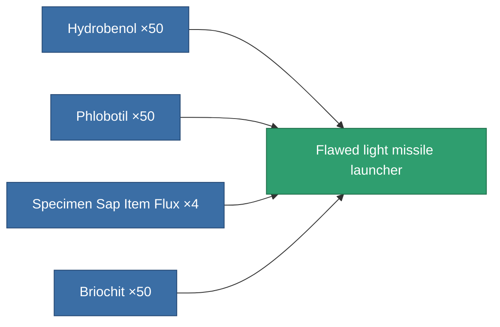

<!-- Generated by tools/generate from the live database (source: entitydefaults definition 3236, aggregatevalues via aggregatefields).
     Do not edit by hand; regenerate instead. -->

# Flawed light missile launcher

|  |  |
|---|---|
| Definition | `def_artifact_damaged_rocket_launcher` |
| Tier | – |
| Health | 100 |
| Volume | 0.5 |
| Mass | 300 |
| Category | Artifacts |

## Stats

| Field | Value |
|---|---|
| accuracy | 1 |
| core_usage | 1 |
| cpu_usage | 30 |
| cycle_time | 10.5k |
| damage_modifier | 1 |
| powergrid_usage | 25 |

<!-- production:generated -->
## Production

**Produced from 4 components** — assemble the components to build it (see [Recipes](/content/recipes/) for the full list):

[All items](/content/items/)
