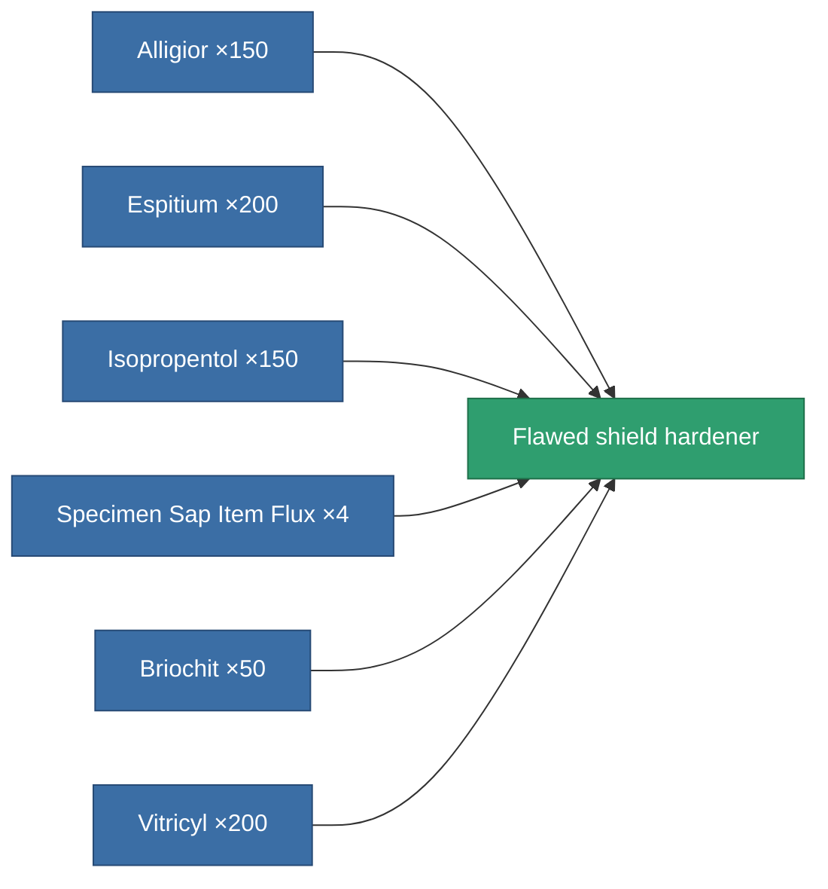

<!-- Generated by tools/generate from the live database (source: entitydefaults definition 3161, aggregatevalues via aggregatefields).
     Do not edit by hand; regenerate instead. -->

# Flawed shield hardener

|  |  |
|---|---|
| Definition | `def_artifact_damaged_shield_hardener` |
| Tier | – |
| Health | 100 |
| Volume | 0.25 |
| Mass | 300 |
| Category | Artifacts |
| Note | ettol a modultol tud jobban mudkodni a pajzs = kevesebb lesz a core csokkenes 5%kal |

## Stats

| Field | Value |
|---|---|
| cpu_usage | 50 |
| powergrid_usage | 20 |
| shield_absorbtion_modifier | 1.15 |

<!-- production:generated -->
## Production

**Produced from 6 components** — assemble the components to build it (see [Recipes](/content/recipes/) for the full list):

[All items](/content/items/)
