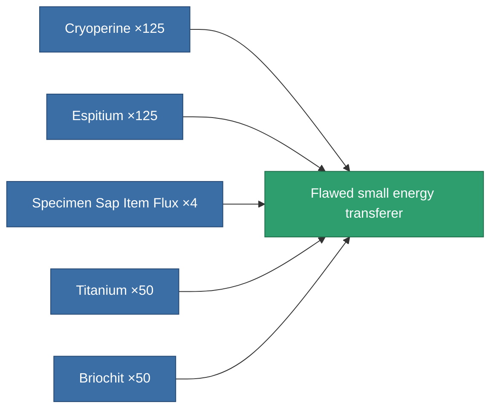

<!-- Generated by tools/generate from the live database (source: entitydefaults definition 3163, aggregatevalues via aggregatefields).
     Do not edit by hand; regenerate instead. -->

# Flawed small energy transferer

|  |  |
|---|---|
| Definition | `def_artifact_damaged_small_energy_transfer` |
| Tier | – |
| Health | 100 |
| Volume | 0.25 |
| Mass | 100 |
| Category | Artifacts |
| Note | range = optimal_range * 	energy_transferers_optimal_range_modifier    cel core += energy_transfer_amount  sajat core -= energy_transfer_amount - 10% |

## Stats

| Field | Value |
|---|---|
| core_usage | 15 |
| cpu_usage | 35 |
| cycle_time | 10k |
| energy_transfer_amount | 30 |
| falloff | 0 |
| optimal_range | 15 |
| powergrid_usage | 30 |

<!-- production:generated -->
## Production

**Produced from 5 components** — assemble the components to build it (see [Recipes](/content/recipes/) for the full list):

[All items](/content/items/)
