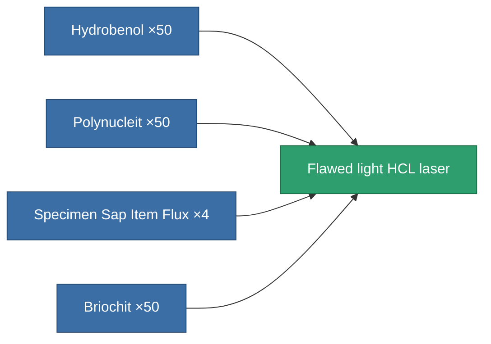

<!-- Generated by tools/generate from the live database (source: entitydefaults definition 3229, aggregatevalues via aggregatefields).
     Do not edit by hand; regenerate instead. -->

# Flawed light HCL laser

|  |  |
|---|---|
| Definition | `def_artifact_damaged_small_laser` |
| Tier | – |
| Health | 100 |
| Volume | 0.25 |
| Mass | 150 |
| Category | Artifacts |

## Stats

| Field | Value |
|---|---|
| accuracy | 4 |
| core_usage | 4 |
| cpu_usage | 20 |
| cycle_time | 4k |
| damage_modifier | 0.6 |
| falloff | 10 |
| least_optimal | 5 |
| optimal_range | 15 |
| powergrid_usage | 40 |

<!-- production:generated -->
## Production

**Produced from 4 components** — assemble the components to build it (see [Recipes](/content/recipes/) for the full list):

[All items](/content/items/)
