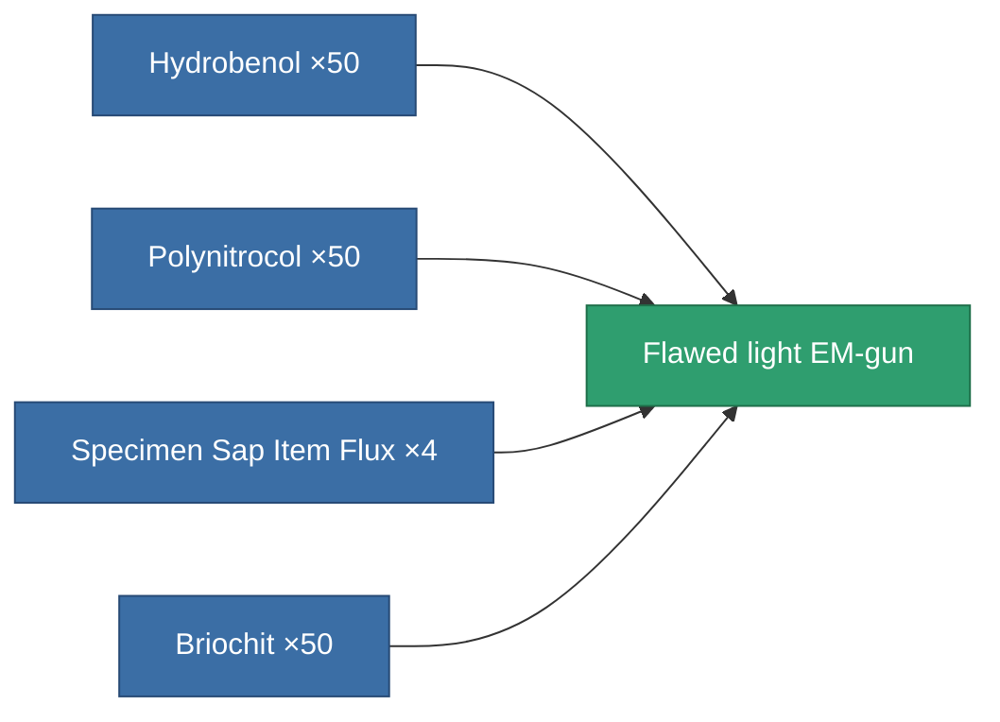

<!-- Generated by tools/generate from the live database (source: entitydefaults definition 3240, aggregatevalues via aggregatefields).
     Do not edit by hand; regenerate instead. -->

# Flawed light EM-gun

|  |  |
|---|---|
| Definition | `def_artifact_damaged_small_railgun` |
| Tier | – |
| Health | 100 |
| Volume | 0.25 |
| Mass | 250 |
| Category | Artifacts |
| Note | RailgunWork: -OptimalRange: a fegyver optionsbol (optimal_range) kiolvas egy alap ?rt?ket , azt megszorozza az accumlator ?rt?k?vel(railgun_optimal_range_modifier); az igy kapott ?rt?ket a fegyver hasznalatakor modositja m?g az ammo optimal range modifier?vel ami az ammo options?ben van (optimalRangeModifier)  -Fallof: a fegyver optionsbol (turret_fallof) kiolvas egy alap?rt?ket, azt megszorozza az accumlator ertekevel (railgun_falloff_modifer), az igy kapott ?rt?ket a fegyver hasznalatokr modositja m?g az ammo falloff modifier?vel ami az ammo options?ben van (falloff_modifier)  -Damage: veszi az ammo sebzeset az ammo options?bol ?s meg szorozza a fegyver optionsbol vett (damage_modifier) sebz?s ?rt?kkel, ?s ezt az accumlatorbol (damage_small_railgun_modifier ?s a damage_railgun_modifier)  -Accuracy: fegyver optionsbol (accuracy) vett ?rt?ket szorozza az accumlatorral (accuracy_modifier) ?s ezt veti ossze a target m?ret?vel (signature_radius); "0-fegyver accuracy" intervallumban vett random float sz?m ha bele esik a "0-target signature_radius ?rt?ke" intervallumban akkor: tal?lt!  -Tracking: k?plet!!! a robot chassis optionsbol veszi az ?rt?ket, ?sszehasonlitja hogy a c?lpont az adott t?vols?gon az adott pillanatban a meroleges haladasi iranyanak sebessege lekovetheto e a trackingspeedel, ha igen:. talalt; ha nem: nem talalt.  -CycleTime:  |

## Stats

| Field | Value |
|---|---|
| accuracy | 5 |
| core_usage | 3.2 |
| cpu_usage | 25 |
| cycle_time | 5k |
| damage_modifier | 0.81 |
| falloff | 5 |
| least_optimal | 8 |
| optimal_range | 12 |
| powergrid_usage | 30 |

<!-- production:generated -->
## Production

**Produced from 4 components** — assemble the components to build it (see [Recipes](/content/recipes/) for the full list):

[All items](/content/items/)
