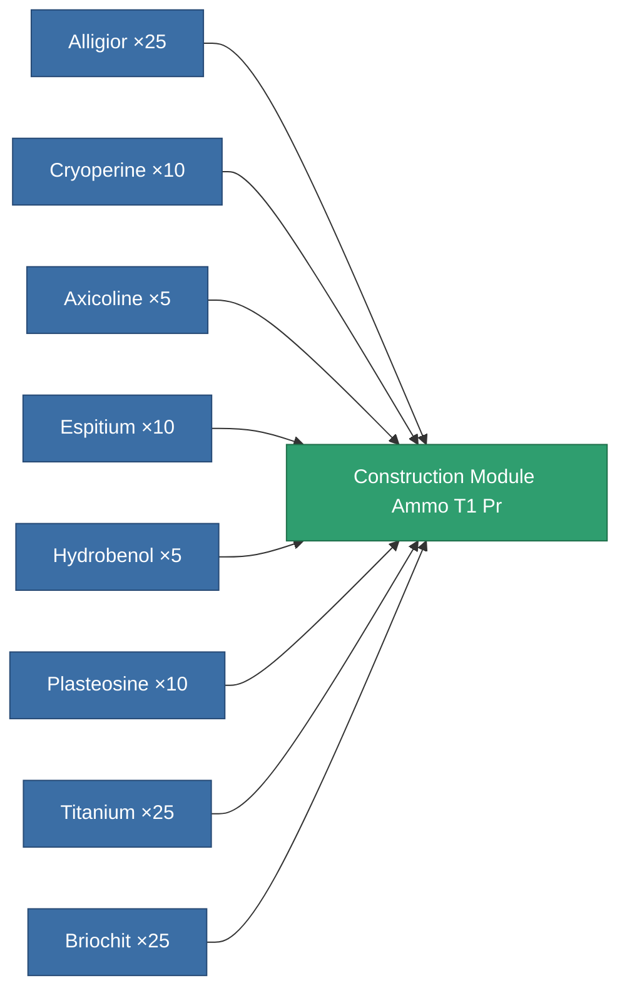

<!-- Generated by tools/generate from the live database (source: entitydefaults definition 6628, aggregatevalues via aggregatefields).
     Do not edit by hand; regenerate instead. -->

# Construction Module Ammo T1 Pr

|  |  |
|---|---|
| Definition | `def_construction_module_ammo_t1_pr` |
| Tier | 1 |
| Health | 100 |
| Volume | 0.1 |
| Mass | 1000 |
| Category | Special & other / Miscellaneous |
| Note | construction blocks |

## Stats

| Field | Value |
|---|---|
| construction_charge_amount | 1 |
| construction_charge_techmax | 1 |

<!-- production:generated -->
## Production

**Produced from 8 components, research level 2** — assemble the components to build it (see [Recipes](/content/recipes/) for the full list):

[All items](/content/items/)
