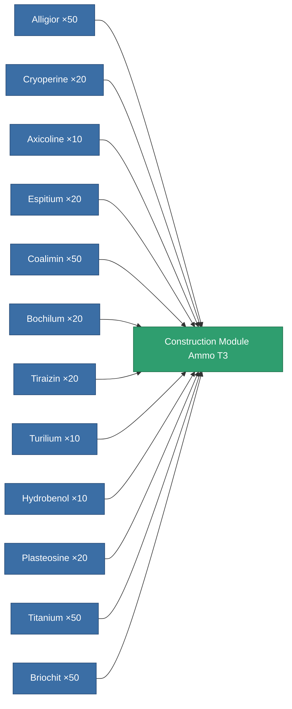

<!-- Generated by tools/generate from the live database (source: entitydefaults definition 6627, aggregatevalues via aggregatefields).
     Do not edit by hand; regenerate instead. -->

# Construction Module Ammo T3

|  |  |
|---|---|
| Definition | `def_construction_module_ammo_t3` |
| Tier | 3 |
| Health | 100 |
| Volume | 0.15 |
| Mass | 1000 |
| Category | Special & other / Miscellaneous |
| Note | construction blocks |

## Stats

| Field | Value |
|---|---|
| construction_charge_amount | 1 |
| construction_charge_techmax | 3 |

<!-- production:generated -->
## Production

**Produced from 12 components** — assemble the components to build it (see [Recipes](/content/recipes/) for the full list):

[All items](/content/items/)
