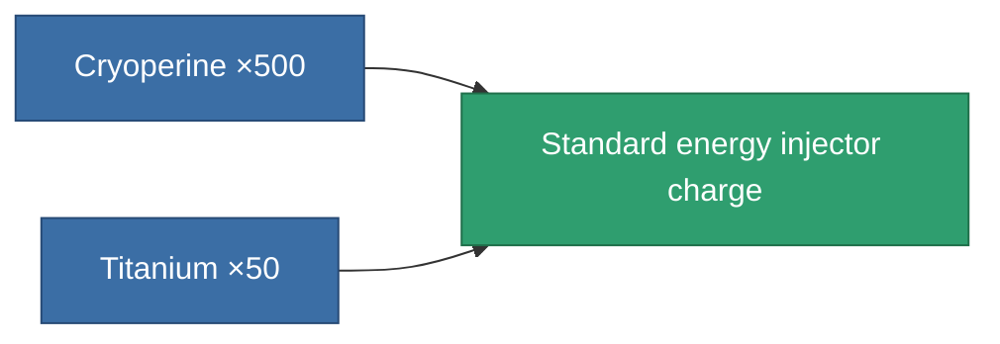

<!-- Generated by tools/generate from the live database (source: entitydefaults definition 664, aggregatevalues via aggregatefields).
     Do not edit by hand; regenerate instead. -->

# Standard energy injector charge

|  |  |
|---|---|
| Definition | `def_corebooster_ammo` |
| Tier | – |
| Health | 100 |
| Volume | 20 |
| Mass | 20 |
| Category | Special & other / Miscellaneous |
| Note | 250 core tolt vissza   |

## Stats

| Field | Value |
|---|---|
| core_added | 250 |

<!-- production:generated -->
## Production

**Produced from 2 components, research level 3** — assemble the components to build it (see [Recipes](/content/recipes/) for the full list):

[All items](/content/items/)
