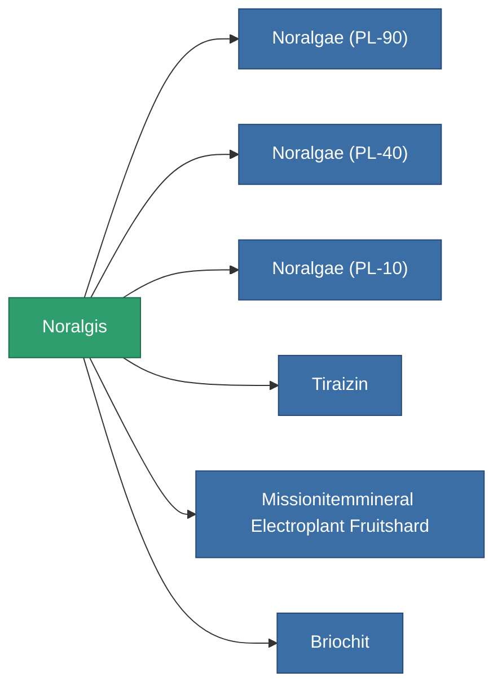

<!-- Generated by tools/generate from the live database (source: entitydefaults definition 2909, aggregatevalues via aggregatefields).
     Do not edit by hand; regenerate instead. -->

# Noralgis

|  |  |
|---|---|
| Definition | `def_electroplant_fruit` |
| Tier | – |
| Health | 100 |
| Volume | 0 |
| Mass | 0.02 |
| Category | Materials |

_No stats — this item carries no aggregate values._

<!-- production:generated -->
## Production

**Component of 6 items** — everything that uses it in production:

[All items](/content/items/)
