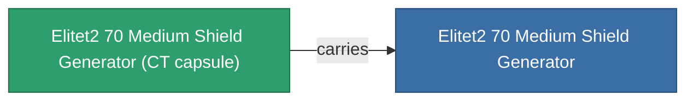

<!-- Generated by tools/generate from the live database (source: entitydefaults definition 5941, aggregatevalues via aggregatefields).
     Do not edit by hand; regenerate instead. -->

# Elitet2 70 Medium Shield Generator

|  |  |
|---|---|
| Definition | `def_elitet2_70_medium_shield_generator` |
| Tier | T2 (special) |
| Health | 100 |
| Volume | 0.5 |
| Mass | 270 |
| Category | Modules / Shield |
| Note | elite module |

## Stats

| Field | Value |
|---|---|
| core_recharge_time_modifier | 0.975 |
| core_usage | 12.5 |
| cpu_usage | 57 |
| cycle_time | 7k |
| powergrid_usage | 214 |
| shield_absorbtion | 2.1277 |
| shield_radius | 12 |

## Transport capsule

A transport capsule (CT) exists for this item — it is how the item moves between players and zones.

## Where to buy

Fixed-price vendors that sell this item (see the [Item shop](/content/shop/) for the full catalog).

| Vendor | Qty | TM Coin | Credits |
|---|---|---|---|
| Daoden outpost | ∞ | 2.5k | 375M |

<!-- production:generated -->
## Production

**Produced from 2 components** — assemble the components to build it (see [Recipes](/content/recipes/) for the full list):

<svg class="prod-card-icon" aria-hidden="true"><use href="#mi-grid"/></svg><a class="prod-card-name" href="/content/items/material-boss-z70/">Material Boss Z70</a>

required: <b>300</b>

<svg class="prod-card-icon" aria-hidden="true"><use href="#mi-tree"/></svg><a class="prod-card-name" href="/content/items/named1-medium-shield-generator/">Parsvaal-IIX medium shield generator</a>

required: <b>1</b>

