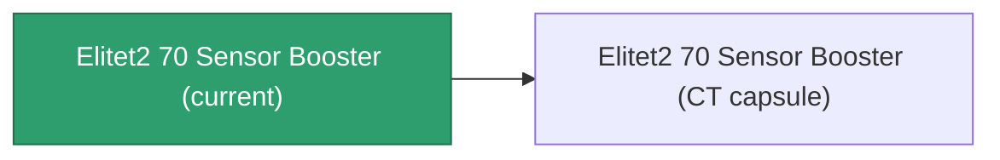

<!-- Generated by tools/generate from the live database (source: entitydefaults definition 5943, aggregatevalues via aggregatefields).
     Do not edit by hand; regenerate instead. -->

# Elitet2 70 Sensor Booster

|  |  |
|---|---|
| Definition | `def_elitet2_70_sensor_booster` |
| Tier | 2 |
| Health | 100 |
| Volume | 0.5 |
| Mass | 60 |
| Category | Modules / Sensors & scanning |
| Note | elite module |

## Stats

| Field | Value |
|---|---|
| core_usage | 8 |
| cpu_usage | 12 |
| cycle_time | 10000 |
| effect_sensor_booster_locking_range_modifier | 1.4 |
| effect_sensor_booster_locking_time_modifier | 0.75 |
| powergrid_usage | 5 |
| sensor_strength_modifier | 17.5 |

## Transport capsule

A transport capsule (CT) exists for this item — it is how the item moves between players and zones.

## Where to buy

Fixed-price vendors that sell this item (see the [Item shop](/content/shop/) for the full catalog).

| Vendor | Qty | Credits | UniCoin |
|---|---|---|---|
| Daoden outpost | 1 | 250000000 | 10000 |

[All items](/content/items/)
