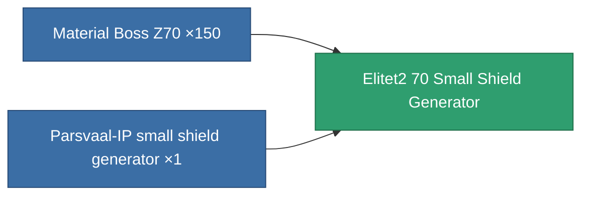

<!-- Generated by tools/generate from the live database (source: entitydefaults definition 5939, aggregatevalues via aggregatefields).
     Do not edit by hand; regenerate instead. -->

# Elitet2 70 Small Shield Generator

|  |  |
|---|---|
| Definition | `def_elitet2_70_small_shield_generator` |
| Tier | 2 |
| Health | 100 |
| Volume | 0.3 |
| Mass | 135 |
| Category | Modules / Shield |
| Note | elite module |

## Stats

| Field | Value |
|---|---|
| core_recharge_time_modifier | 0.97 |
| core_usage | 1 |
| cpu_usage | 38 |
| cycle_time | 2.25k |
| powergrid_usage | 43 |
| shield_absorbtion | 2.1277 |
| shield_radius | 5 |

## Transport capsule

A transport capsule (CT) exists for this item — it is how the item moves between players and zones.

## Where to buy

Fixed-price vendors that sell this item (see the [Item shop](/content/shop/) for the full catalog).

| Vendor | Qty | TM Coin | Credits |
|---|---|---|---|
| Daoden outpost | ∞ | 2.5k | 375M |

<!-- production:generated -->
## Production

**Produced from 2 components** — assemble the components to build it (see [Recipes](/content/recipes/) for the full list):

[All items](/content/items/)
