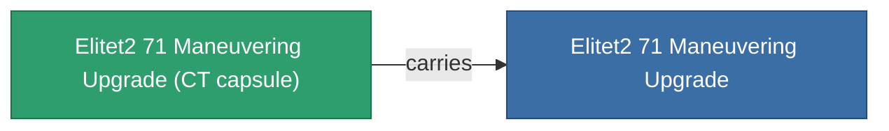

<!-- Generated by tools/generate from the live database (source: entitydefaults definition 6056, aggregatevalues via aggregatefields).
     Do not edit by hand; regenerate instead. -->

# Elitet2 71 Maneuvering Upgrade

|  |  |
|---|---|
| Definition | `def_elitet2_71_maneuvering_upgrade` |
| Tier | T2 (special) |
| Health | 100 |
| Volume | 0.5 |
| Mass | 17 |
| Category | Modules / Enhancements |
| Note | elite module |

## Stats

| Field | Value |
|---|---|
| armor_max | 110 |
| cpu_usage | 19 |
| massiveness | 0.05 |
| powergrid_usage | 21 |
| signature_radius | -1 |

## Transport capsule

A transport capsule (CT) exists for this item — it is how the item moves between players and zones.

## Where to buy

Fixed-price vendors that sell this item (see the [Item shop](/content/shop/) for the full catalog).

| Vendor | Qty | Credits | UniCoin |
|---|---|---|---|
| Daoden outpost | ∞ | 250M | 10k |

<!-- production:generated -->
## Production

**Produced from 2 components** — assemble the components to build it (see [Recipes](/content/recipes/) for the full list):

<svg class="prod-card-icon" aria-hidden="true"><use href="#mi-grid"/></svg><a class="prod-card-name" href="/content/items/material-boss-z71/">Material Boss Z71</a>

required: <b>300</b>

<svg class="prod-card-icon" aria-hidden="true"><use href="#mi-panel"/></svg><a class="prod-card-name" href="/content/items/named1-maneuvering-upgrade/">R4S-S evasive module</a>

required: <b>1</b>

