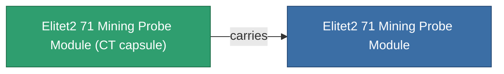
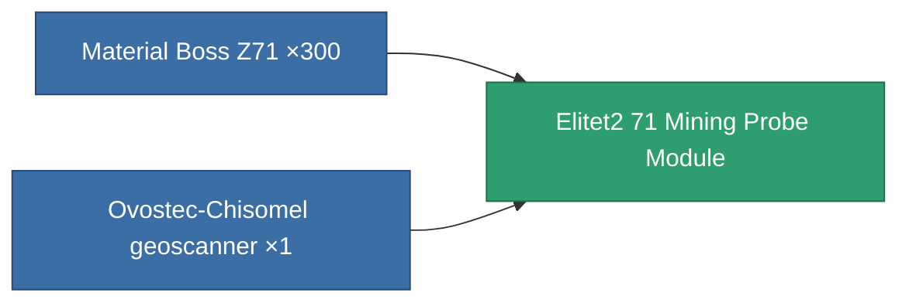

<!-- Generated by tools/generate from the live database (source: entitydefaults definition 6050, aggregatevalues via aggregatefields).
     Do not edit by hand; regenerate instead. -->

# Elitet2 71 Mining Probe Module

|  |  |
|---|---|
| Definition | `def_elitet2_71_mining_probe_module` |
| Tier | T2 (special) |
| Health | 100 |
| Volume | 0.5 |
| Mass | 135 |
| Category | Modules / Enhancements |
| Note | elite module |

## Stats

| Field | Value |
|---|---|
| core_usage | 45 |
| cpu_usage | 38 |
| cycle_time | 15k |
| mining_probe_accuracy | 0.6 |
| powergrid_usage | 43 |
| stealth_strength | 10 |

## Transport capsule

A transport capsule (CT) exists for this item — it is how the item moves between players and zones.

## Where to buy

Fixed-price vendors that sell this item (see the [Item shop](/content/shop/) for the full catalog).

| Vendor | Qty | Credits | UniCoin |
|---|---|---|---|
| Daoden outpost | ∞ | 250M | 10k |

<!-- production:generated -->
## Production

**Produced from 2 components** — assemble the components to build it (see [Recipes](/content/recipes/) for the full list):

[All items](/content/items/)
