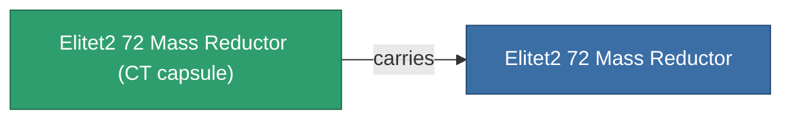

<!-- Generated by tools/generate from the live database (source: entitydefaults definition 6054, aggregatevalues via aggregatefields).
     Do not edit by hand; regenerate instead. -->

# Elitet2 72 Mass Reductor

|  |  |
|---|---|
| Definition | `def_elitet2_72_mass_reductor` |
| Tier | T2 (special) |
| Health | 100 |
| Volume | 0.5 |
| Mass | 1.5 |
| Category | Modules / Enhancements |
| Note | elite module |

## Stats

| Field | Value |
|---|---|
| armor_max_modifier | 0.725 |
| cpu_usage | 5 |
| massiveness | -0.2 |
| powergrid_usage | 2 |
| signature_radius | -0.2 |
| speed_max_modifier | 1.19 |

## Transport capsule

A transport capsule (CT) exists for this item — it is how the item moves between players and zones.

## Where to buy

Fixed-price vendors that sell this item (see the [Item shop](/content/shop/) for the full catalog).

| Vendor | Qty | Credits | UniCoin |
|---|---|---|---|
| Daoden outpost | ∞ | 250M | 10k |

<!-- production:generated -->
## Production

**Produced from 2 components** — assemble the components to build it (see [Recipes](/content/recipes/) for the full list):

<svg class="prod-card-icon" aria-hidden="true"><use href="#mi-grid"/></svg><a class="prod-card-name" href="/content/items/material-boss-z72/">Material Boss Z72</a>

required: <b>300</b>

<svg class="prod-card-icon" aria-hidden="true"><use href="#mi-grid"/></svg><a class="prod-card-name" href="/content/items/named1-mass-reductor/">MR1000-Boogey lightweight frame</a>

required: <b>1</b>

