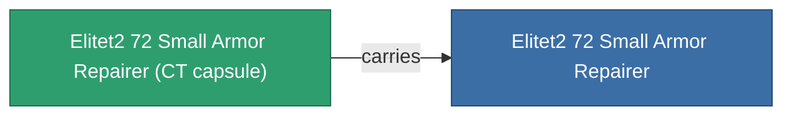

<!-- Generated by tools/generate from the live database (source: entitydefaults definition 6042, aggregatevalues via aggregatefields).
     Do not edit by hand; regenerate instead. -->

# Elitet2 72 Small Armor Repairer

|  |  |
|---|---|
| Definition | `def_elitet2_72_small_armor_repairer` |
| Tier | T2 (special) |
| Health | 100 |
| Volume | 1 |
| Mass | 168.75 |
| Category | Modules / Repair |
| Note | elite module |

## Stats

| Field | Value |
|---|---|
| armor_max | 110 |
| armor_repair_amount | 65 |
| core_usage | 54 |
| cpu_usage | 29 |
| cycle_time | 13.5k |
| powergrid_usage | 17 |

## Transport capsule

A transport capsule (CT) exists for this item — it is how the item moves between players and zones.

## Where to buy

Fixed-price vendors that sell this item (see the [Item shop](/content/shop/) for the full catalog).

| Vendor | Qty | ICS Coin | Credits |
|---|---|---|---|
| Daoden outpost | ∞ | 2.5k | 375M |

<!-- production:generated -->
## Production

**Produced from 2 components** — assemble the components to build it (see [Recipes](/content/recipes/) for the full list):

<svg class="prod-card-icon" aria-hidden="true"><use href="#mi-grid"/></svg><a class="prod-card-name" href="/content/items/material-boss-z72/">Material Boss Z72</a>

required: <b>150</b>

<svg class="prod-card-icon" aria-hidden="true"><use href="#mi-tree"/></svg><a class="prod-card-name" href="/content/items/named1-small-armor-repairer/">A150 small armor repairer</a>

required: <b>1</b>

