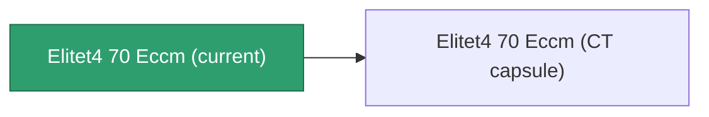

<!-- Generated by tools/generate from the live database (source: entitydefaults definition 5948, aggregatevalues via aggregatefields).
     Do not edit by hand; regenerate instead. -->

# Elitet4 70 Eccm

|  |  |
|---|---|
| Definition | `def_elitet4_70_eccm` |
| Tier | 4 |
| Health | 100 |
| Volume | 0.5 |
| Mass | 75 |
| Category | Modules / Enhancements |
| Note | elite module |

## Stats

| Field | Value |
|---|---|
| cpu_usage | 24 |
| damage_laser_modifier | 0.07 |
| damage_missile_modifier | 0.07 |
| damage_projectile_modifier | 0.07 |
| damage_railgun_modifier | 0.07 |
| powergrid_usage | 16 |
| sensor_strength_modifier | 78 |

## Transport capsule

A transport capsule (CT) exists for this item — it is how the item moves between players and zones.

## Where to buy

Fixed-price vendors that sell this item (see the [Item shop](/content/shop/) for the full catalog).

| Vendor | Qty | Credits | UniCoin |
|---|---|---|---|
| Daoden outpost | 1 | 500000000 | 25000 |

[All items](/content/items/)
