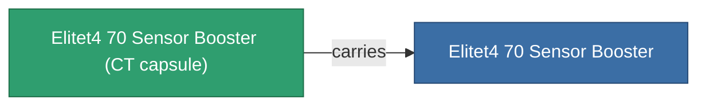

<!-- Generated by tools/generate from the live database (source: entitydefaults definition 5944, aggregatevalues via aggregatefields).
     Do not edit by hand; regenerate instead. -->

# Elitet4 70 Sensor Booster

|  |  |
|---|---|
| Definition | `def_elitet4_70_sensor_booster` |
| Tier | 4 |
| Health | 100 |
| Volume | 0.5 |
| Mass | 75 |
| Category | Modules / Sensors & scanning |
| Note | elite module |

## Stats

| Field | Value |
|---|---|
| core_usage | 10 |
| cpu_usage | 18 |
| cycle_time | 10k |
| effect_sensor_booster_locking_range_modifier | 1.45 |
| effect_sensor_booster_locking_time_modifier | 0.65 |
| powergrid_usage | 9 |
| sensor_strength_modifier | 25 |

## Transport capsule

A transport capsule (CT) exists for this item — it is how the item moves between players and zones.

## Where to buy

Fixed-price vendors that sell this item (see the [Item shop](/content/shop/) for the full catalog).

| Vendor | Qty | Credits | UniCoin |
|---|---|---|---|
| Daoden outpost | ∞ | 500M | 25k |

[All items](/content/items/)
