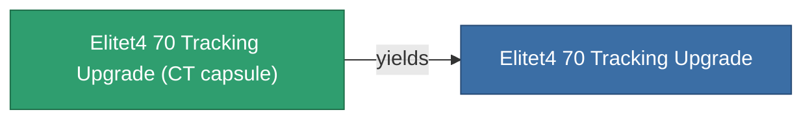

<!-- Generated by tools/generate from the live database (source: entitydefaults definition 5994, aggregatevalues via aggregatefields).
     Do not edit by hand; regenerate instead. -->

# Elitet4 70 Tracking Upgrade (CT capsule)

|  |  |
|---|---|
| Definition | `def_elitet4_70_tracking_upgrade_CT_capsule` |
| Tier | T4 (special) |
| Health | 100 |
| Volume | 0.1 |
| Mass | 0.1 |
| Category | Modules / Enhancements |
| Note | elite module |

_No stats — this item carries no aggregate values._

## Production

The item this capsule carries, and how it is produced (see [Recipes](/content/recipes/) for the full list).

|  |  |
|---|---|
| Research level | – |
| Production cost | Material Boss Z70 ×400, ATCS-gh50 range extender ×1 |
| Output | [Elitet4 70 Tracking Upgrade](/content/items/elitet4-70-tracking-upgrade/) |

## Where to buy

Fixed-price vendors that sell this item (see the [Item shop](/content/shop/) for the full catalog).

| Vendor | Qty | Credits | UniCoin |
|---|---|---|---|
| New Virginia (zone_TM) | ∞ | 1.6M | 80 |
| Attalica (zone_ICS) | ∞ | 1.6M | 80 |
| Attalica outpost | ∞ | 1.6M | 80 |
| Daoden (zone_ASI) | ∞ | 1.6M | 80 |
| Daoden outpost | ∞ | 1.6M | 80 |
