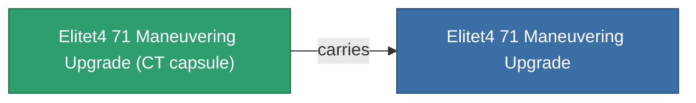

<!-- Generated by tools/generate from the live database (source: entitydefaults definition 6057, aggregatevalues via aggregatefields).
     Do not edit by hand; regenerate instead. -->

# Elitet4 71 Maneuvering Upgrade

|  |  |
|---|---|
| Definition | `def_elitet4_71_maneuvering_upgrade` |
| Tier | 4 |
| Health | 100 |
| Volume | 0.5 |
| Mass | 25 |
| Category | Modules / Enhancements |
| Note | elite module |

## Stats

| Field | Value |
|---|---|
| armor_max | 180 |
| cpu_usage | 27 |
| massiveness | 0.075 |
| powergrid_usage | 26 |
| signature_radius | -1.2 |

## Transport capsule

A transport capsule (CT) exists for this item — it is how the item moves between players and zones.

## Where to buy

Fixed-price vendors that sell this item (see the [Item shop](/content/shop/) for the full catalog).

| Vendor | Qty | Credits | UniCoin |
|---|---|---|---|
| Daoden outpost | ∞ | 500M | 25k |

[All items](/content/items/)
