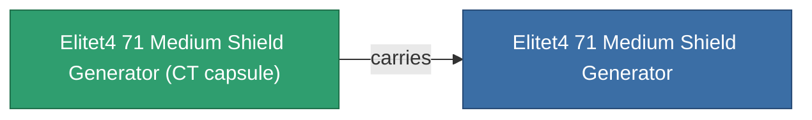

<!-- Generated by tools/generate from the live database (source: entitydefaults definition 6049, aggregatevalues via aggregatefields).
     Do not edit by hand; regenerate instead. -->

# Elitet4 71 Medium Shield Generator

|  |  |
|---|---|
| Definition | `def_elitet4_71_medium_shield_generator` |
| Tier | T4 (special) |
| Health | 100 |
| Volume | 0.5 |
| Mass | 352.5 |
| Category | Modules / Shield |
| Note | elite module |

## Stats

| Field | Value |
|---|---|
| core_usage | 10 |
| cpu_usage | 67 |
| cycle_time | 6.5k |
| powergrid_usage | 271 |
| shield_absorbtion | 2 |
| shield_radius | 25 |
| signature_radius | -0.6 |

## Transport capsule

A transport capsule (CT) exists for this item — it is how the item moves between players and zones.

## Where to buy

Fixed-price vendors that sell this item (see the [Item shop](/content/shop/) for the full catalog).

| Vendor | Qty | TM Coin | Credits |
|---|---|---|---|
| Daoden outpost | ∞ | 5k | 750M |

<!-- production:generated -->
## Production

**Produced from 2 components** — assemble the components to build it (see [Recipes](/content/recipes/) for the full list):

<svg class="prod-card-icon" aria-hidden="true"><use href="#mi-grid"/></svg><a class="prod-card-name" href="/content/items/material-boss-z71/">Material Boss Z71</a>

required: <b>400</b>

<svg class="prod-card-icon" aria-hidden="true"><use href="#mi-tree"/></svg><a class="prod-card-name" href="/content/items/named3-medium-shield-generator/">Penik medium shield generator</a>

required: <b>1</b>

