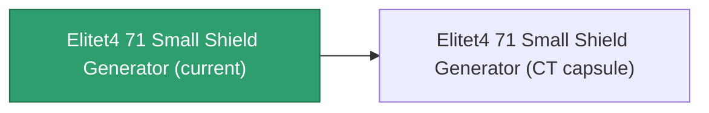

<!-- Generated by tools/generate from the live database (source: entitydefaults definition 6047, aggregatevalues via aggregatefields).
     Do not edit by hand; regenerate instead. -->

# Elitet4 71 Small Shield Generator

|  |  |
|---|---|
| Definition | `def_elitet4_71_small_shield_generator` |
| Tier | 4 |
| Health | 100 |
| Volume | 0.3 |
| Mass | 172.5 |
| Category | Modules / Shield |
| Note | elite module |

## Stats

| Field | Value |
|---|---|
| core_usage | 1 |
| cpu_usage | 48 |
| cycle_time | 2000 |
| powergrid_usage | 54 |
| shield_absorbtion | 2 |
| shield_radius | 6 |
| signature_radius | -0.3 |

## Transport capsule

A transport capsule (CT) exists for this item — it is how the item moves between players and zones.

## Where to buy

Fixed-price vendors that sell this item (see the [Item shop](/content/shop/) for the full catalog).

| Vendor | Qty | TM Coin | Credits |
|---|---|---|---|
| Daoden outpost | 1 | 5000 | 750000000 |

[All items](/content/items/)
