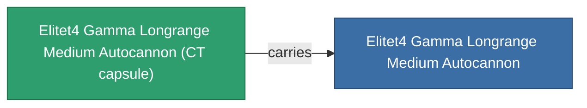

<!-- Generated by tools/generate from the live database (source: entitydefaults definition 6206, aggregatevalues via aggregatefields).
     Do not edit by hand; regenerate instead. -->

# Elitet4 Gamma Longrange Medium Autocannon

|  |  |
|---|---|
| Definition | `def_elitet4_gamma_longrange_medium_autocannon` |
| Tier | T4 (special) |
| Health | 100 |
| Volume | 1.2 |
| Mass | 715 |
| Category | Modules / Weapons |
| Note | elite module |

## Stats

| Field | Value |
|---|---|
| accuracy | 18 |
| core_usage | 2 |
| cpu_usage | 13 |
| cycle_time | 9k |
| damage_modifier | 2.85 |
| falloff | 32 |
| least_optimal | 5 |
| optimal_range | 24 |
| powergrid_usage | 143 |

## Transport capsule

A transport capsule (CT) exists for this item — it is how the item moves between players and zones.

## Where to buy

Fixed-price vendors that sell this item (see the [Item shop](/content/shop/) for the full catalog).

| Vendor | Qty | Credits | UniCoin |
|---|---|---|---|
| Daoden outpost | ∞ | 500M | 25k |

<!-- production:generated -->
## Production

**Produced from 2 components** — assemble the components to build it (see [Recipes](/content/recipes/) for the full list):

<svg class="prod-card-icon" aria-hidden="true"><use href="#mi-grid"/></svg><a class="prod-card-name" href="/content/items/material-boss-gamma-syndicate/">Material Boss Gamma Syndicate</a>

required: <b>400</b>

<svg class="prod-card-icon" aria-hidden="true"><use href="#mi-robots"/></svg><a class="prod-card-name" href="/content/items/named3-longrange-medium-autocannon/">Znatvoy-Berjiar-IA medium autocannon</a>

required: <b>1</b>

