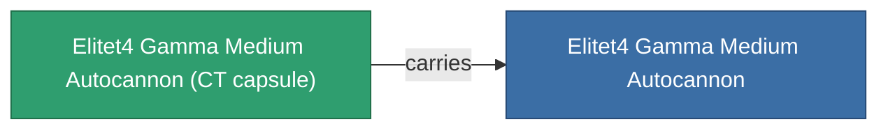

<!-- Generated by tools/generate from the live database (source: entitydefaults definition 6205, aggregatevalues via aggregatefields).
     Do not edit by hand; regenerate instead. -->

# Elitet4 Gamma Medium Autocannon

|  |  |
|---|---|
| Definition | `def_elitet4_gamma_medium_autocannon` |
| Tier | 4 |
| Health | 100 |
| Volume | 1.2 |
| Mass | 550 |
| Category | Modules / Weapons |
| Note | elite module |

## Stats

| Field | Value |
|---|---|
| accuracy | 17 |
| core_usage | 2 |
| cpu_usage | 12 |
| cycle_time | 3k |
| damage_modifier | 1.425 |
| falloff | 18.5 |
| least_optimal | 2 |
| optimal_range | 15 |
| powergrid_usage | 133 |

## Transport capsule

A transport capsule (CT) exists for this item — it is how the item moves between players and zones.

## Where to buy

Fixed-price vendors that sell this item (see the [Item shop](/content/shop/) for the full catalog).

| Vendor | Qty | Credits | UniCoin |
|---|---|---|---|
| Daoden outpost | ∞ | 500M | 25k |

[All items](/content/items/)
